# Homework week 2 - Bandit tasks 

## Bandit Level 0
>The goal of this level is for you to log into the game using SSH. The host to which you need to connect is bandit.labs.overthewire.org, on port 2220. The username is bandit0 and the password is bandit0. Once logged in, go to the Level 1 page to find out how to beat Level 1.

Screenshot of the terminal

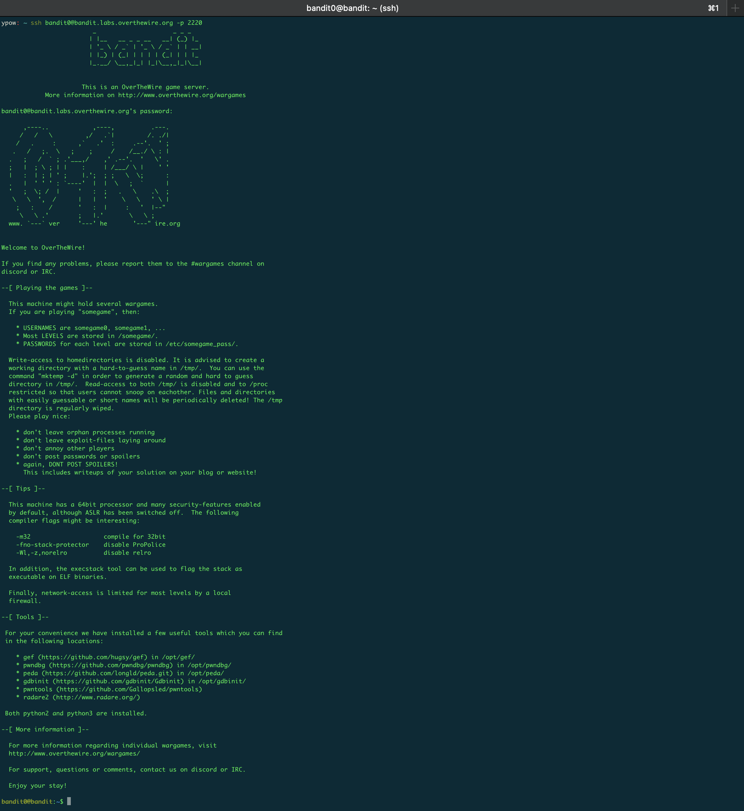

Commands that are used for this level 

`ypow: ~ ssh bandit0@bandit.labs.overthewire.org -p 2220`

`$ ssh <username>@<remote> -p 0000` 

`ssh` - we use this command to login to remote server. 

`<username>@<remote-host>` - **\<username\>** Username for the user from the server/computer to which we connect & **\<remote-host\>** address for the remote computer/server. 

`-p 0000` - Port to connect to on the remote host

If we have key file we can use `-i  identity_file.pem` - Selects a cryptographic key file from which the identity (private key) for public key authentication is read 

More about ssh - [Secure Shell (SSH) on Wikipedia.](https://en.wikipedia.org/wiki/Secure_Shell)

## Bandit Level 0 → Level 1

>The password for the next level is stored in a file called readme located in the home directory. Use this password to log into bandit1 using SSH. Whenever you find a password for a level, use SSH (on port 2220) to log into that level and continue the game.

Screenshot of the terminal

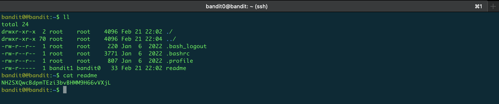

Commands that are used for this level 

`$ ll` - we use this command to list all files and directories.

 `ll` is an alias for `ls -alF`, `-a`-(all) see hidden files, `-l`- (long linting) provide detailed information about each file, `-F` - Display a slash (‘/’) immediately after each pathname that is a directory

`$ cat` we use this command to display the contents of a file
 
## Bandit Level 1 → Level 2
>The password for the next level is stored in a file called - located in the home directory

Screenshot of the terminal
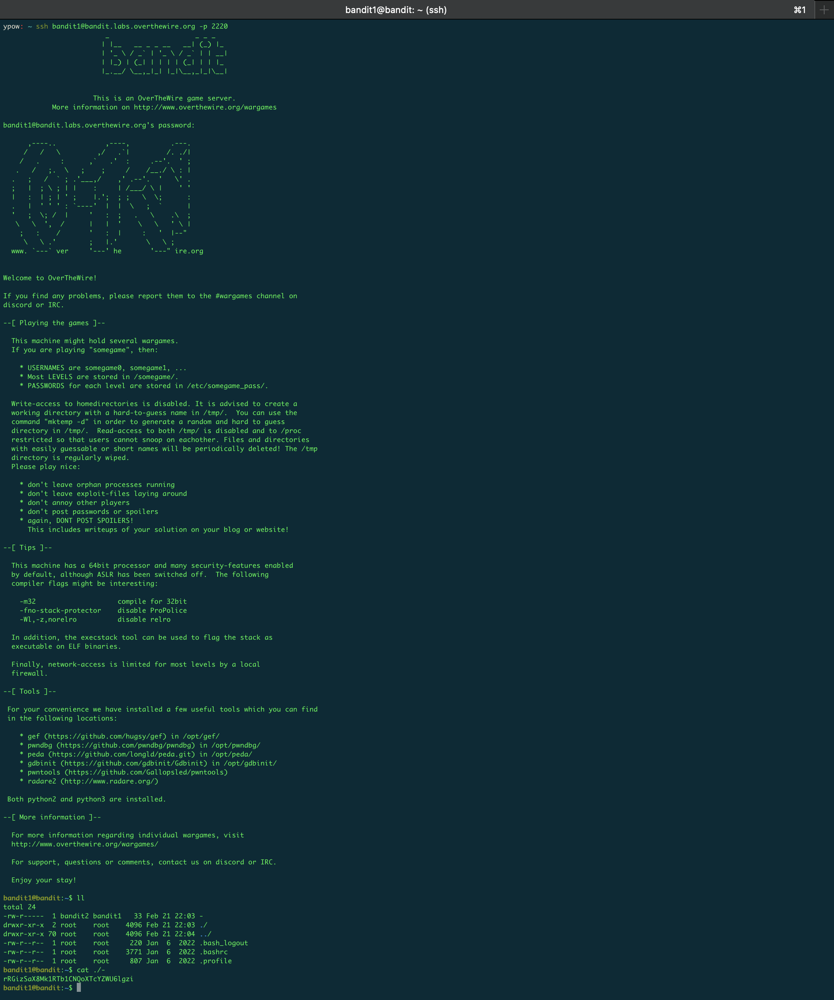
Commands that are used for this level 

`$ ssh bandit1@bandit.labs.overthewire.org -p 2220` - already used this command but with different username

`$ ll`  - already used this command

`$ cat ./-` we use this command to display the contents of a dash file, the reason why we do not use only `cat -` is that the `-` the command assumes we are trying to pass an input argument instead of an operand to the command (an STDIN and wait for user INPUT on the screen).

Anther way to display the contents of the file is `cat < -`  we can tweak the cat syntax to check the content of (-). The result will be the same as with the first command.

## Bandit Level 2 → Level 3
>The password for the next level is stored in a file called **spaces in this filename** located in the home directory

Screenshot of the terminal

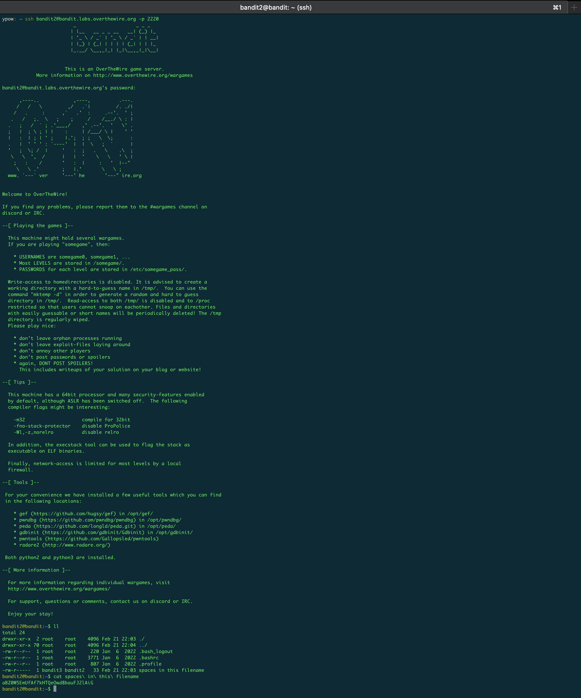

Commands that are used for this level:

`$ ssh bandit2@bandit.labs.overthewire.org -p 2220` - already used this command but with different username

`$ ll`  - already used this command

`$ cat spaces\ in\ this\ filename` we need use the `\` for space because the space a special character in Linux shell, so the single quote in Shell ignores all type of special characters in it. When we create the file we can also use the `\` for space or just add the file name in the `""`.

`$ cat "spaces in this filename"` or we can use `""`
 
## Bandit Level 3 → Level 4

>The password for the next level is stored in a hidden file in the inhere directory.

Screenshot of the terminal

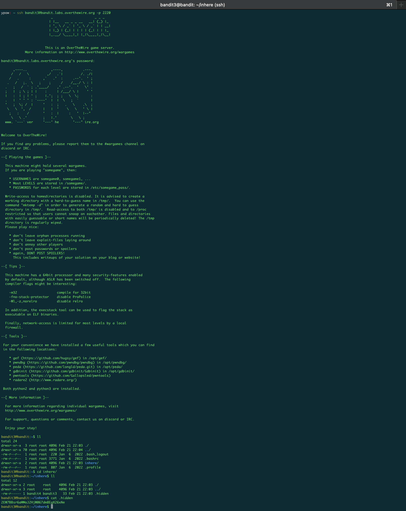

Commands that are used for this level 

`$ ssh bandit3@bandit.labs.overthewire.org -p 2220` - already used this command but with different username

`$ ll`  - already used this command

`$ cd inhere/`  - we use this command to switch to **inhere** directive

`$ ll`  - already used this command. It will show as the hidden files also. [I have already described it in the above task.](#bandit-level-0-→-level-1)

`$ cat .hidden`  - in the Linux Shell with the `.` we hide the file. So if we want to use that file we need also to add the `.` before the filename.

## Bandit Level 4 → Level 5

>The password for the next level is stored in the only human-readable file in the inhere directory. Tip: if your terminal is messed up, try the “reset” command.

Screenshot of the terminal

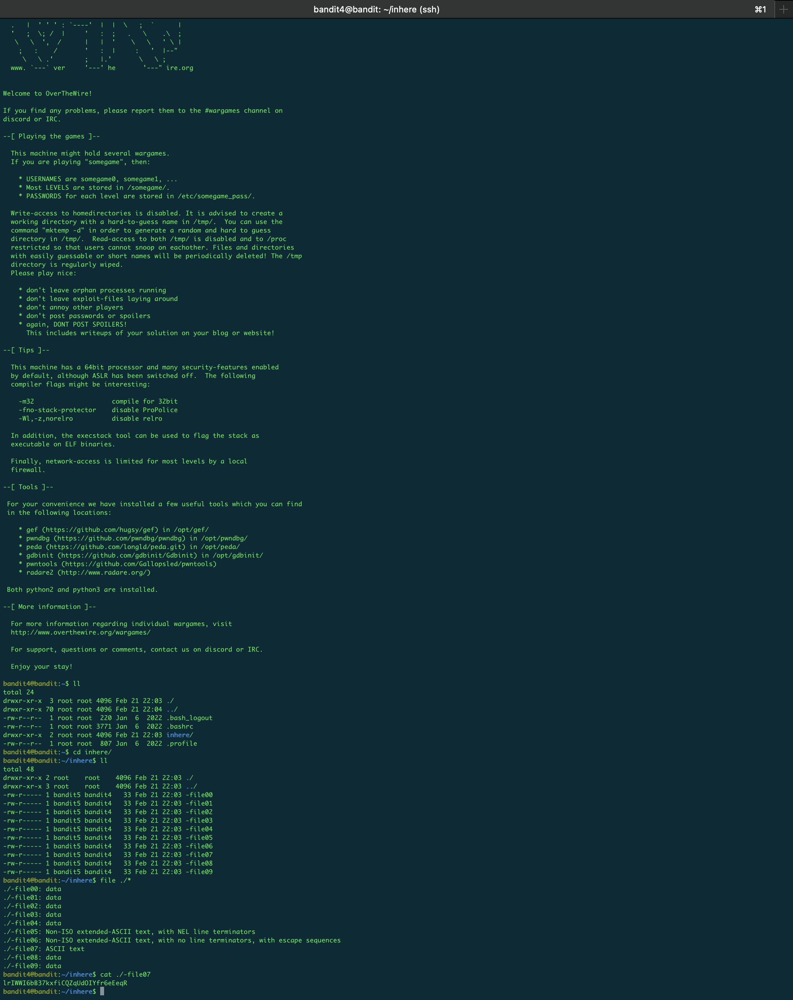

Commands that are used for this level:

`$ ssh bandit4@bandit.labs.overthewire.org -p 2220` - already used this command but with different username

`$ ll`  - already used this command

`$ cd inhere/`  - already used this command

`$ ll`  - already used this command

`$ file ./*` - this command shows us what type files are, so we can se that only human-readable file is file `-file07` which is **ASCII text**

`$ cat ./-file07` display the file content

## Bandit Level 5 → Level 6

> The password for the next level is stored in a file somewhere under the inhere directory and has all of the following properties: 
>>1. human-readable; 
>>2. 1033 bytes in size; 
>>3. not executable

Screenshot of the terminal

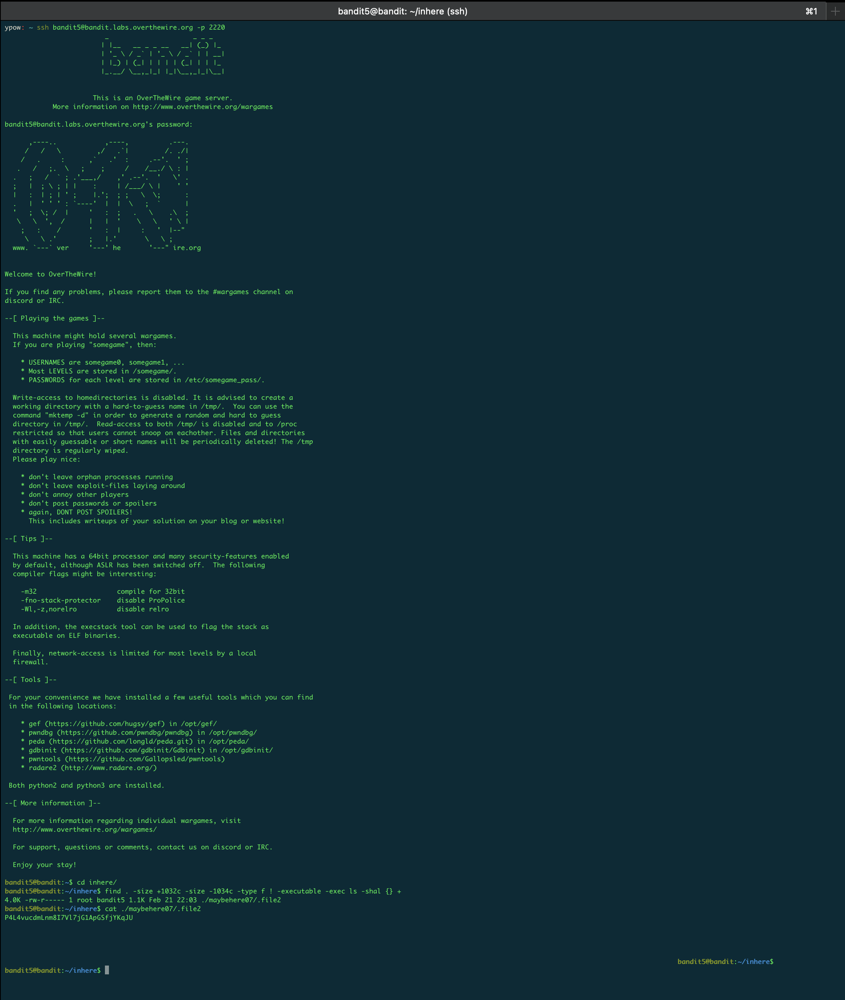

Commands that are used for this level:

`$ ssh bandit5@bandit.labs.overthewire.org -p 2220` - already used this command but with different username

`$ ll`  - already used this command

`$ cd inhere/`  - already used this command

`$ ll`  - already used this command

`$ find . -size +1032c -size -1034c -type f ! -executable -exec ls -shal {} +` 

- We use `find .` because we have a condition we can search in the directory by it. 
- Command `-size +1032c` means that we search files that have more than 1032 bytes & `-size -1034c` search file that have less than 1034 bytes. 
- Command `-type f ! -executable -exec` means to search the not executable files. 
- Command `-exec ls -shal {} +` list the files and show all details of them and order by asc **(`+`)**.

`-size 1033c` or use this command for specified exactly size

`$ cat ./maybehere07/.file2` - human-readable file

[Nice article for find examples.](https://www.digitalocean.com/community/tutorials/how-to-use-find-and-locate-to-search-for-files-on-linux)

## Bandit Level 6 → Level 7
>The password for the next level is stored somewhere on the server and has all of the following properties:
>>1. owned by user bandit7
>>2. owned by group bandit6
>>3. 33 bytes in size

Screenshot of the terminal

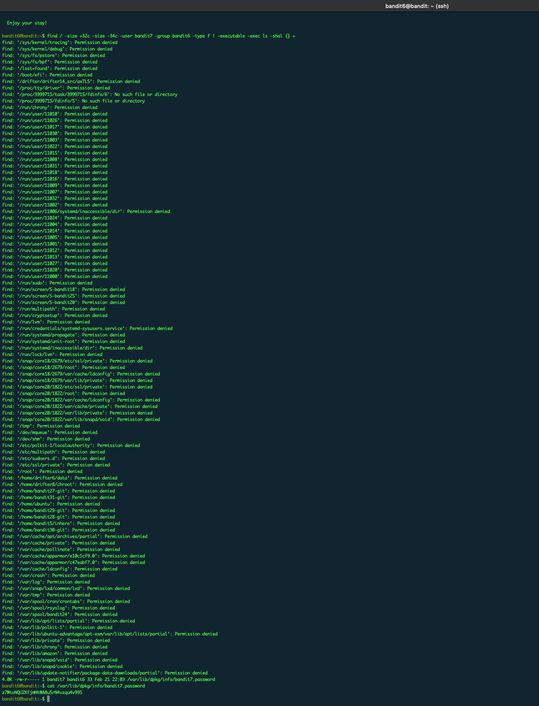

Commands that are used for this level 

`$ ssh bandit6@bandit.labs.overthewire.org -p 2220` - already used this command but with different username

`$ find / -size +32c -size -34c -user bandit7 -group bandit6 -type f ! -executable -exec ls -shal {} +`

- Command `find /` - find a file from any directory 
- Command `-size +32c -size -34c` - [already explained in the task above](#bandit-level-5-→-level-6)
- Command `-user bandit7` search the files only of the user **bandit7**
- Command `-group bandit6` search the files only of the group **bandit7** 
- Command `-type f ! -executable -exec ls -shal {} +` - [already explained in the task above](#bandit-level-5-→-level-6)

`-size 33c` or use this command for specified exactly size

`$ cat /var/lib/dpkg/info/bandit7.password` - human-readable file

## Bandit Level 7 → Level 8

>The password for the next level is stored in the file data.txt next to the word millionth

Screenshot of the terminal

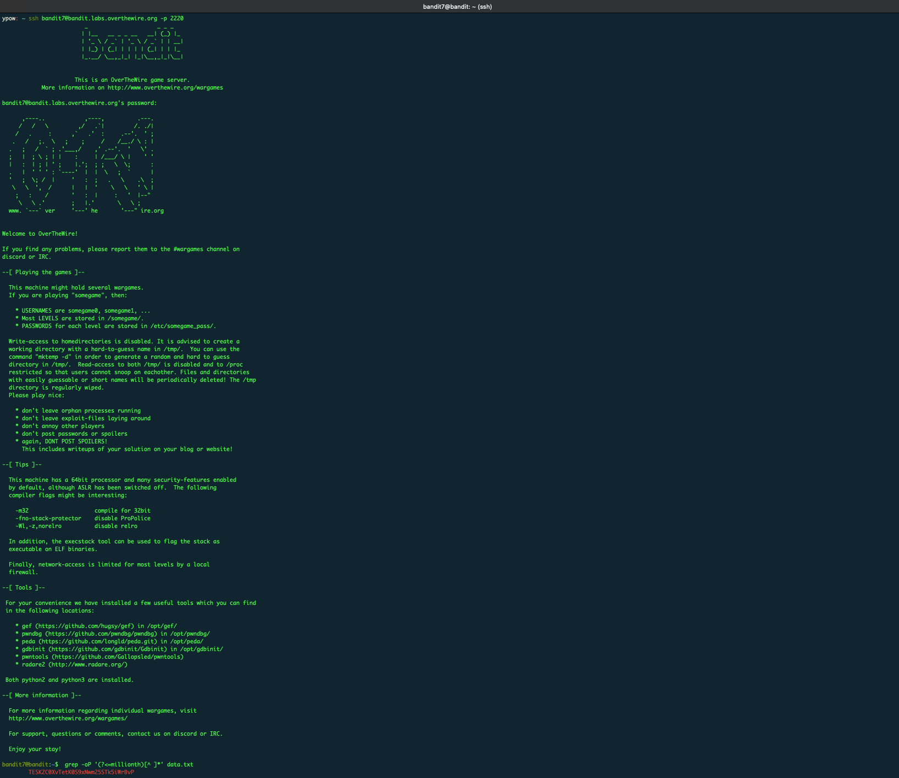

Commands that are used for this level 

`$ ssh bandit7@bandit.labs.overthewire.org -p 2220` - already used this command but with different username

`$ grep -oP '(?<=millionth)[^ ]*' data.txt` 
- for search word in the file we use `grep` command
- after it we use regular expressions (`'(?<=millionth)[^ ]*'`) to find the specified word in this case `millionth` and by expressions we print the next word 
## Bandit Level 8 → Level 9

>The password for the next level is stored in the file data.txt and is the only line of text that occurs only once

Screenshot of the terminal

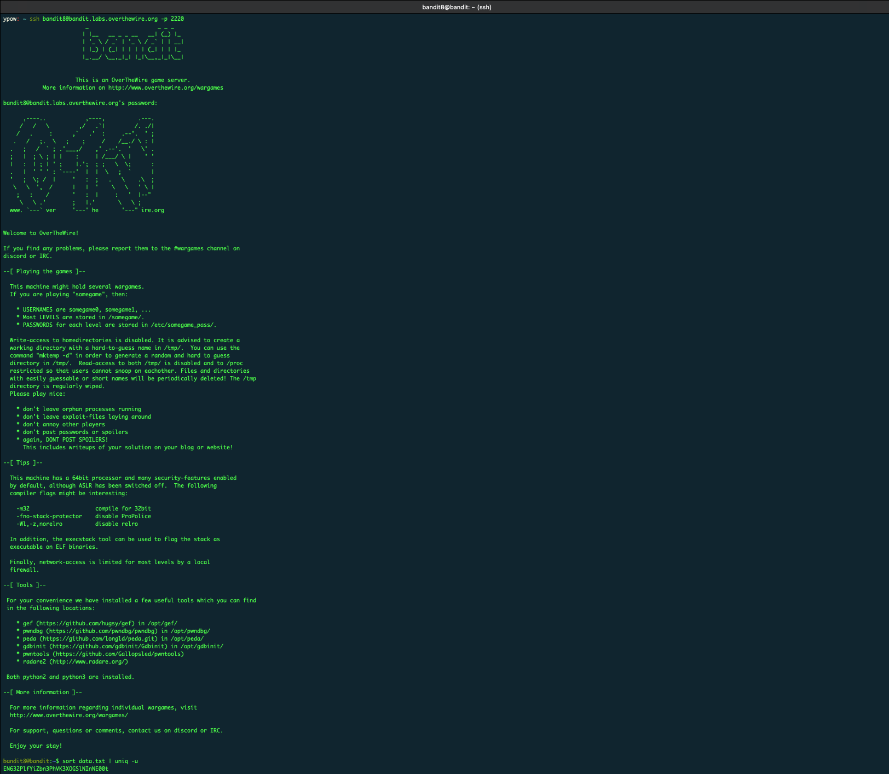

Commands that are used for this level 

`$ ssh bandit8@bandit.labs.overthewire.org -p 2220` - already used this command but with different username

`sort data.txt | uniq -u` 

- Command `sort` is used to sort all data in the specified file
- Command `uniq -u` to return only uniq one, that not repeat

## Bandit Level 9 → Level 10

>The password for the next level is stored in the file data.txt in one of the few human-readable strings, preceded by several ‘=’ characters.

Screenshot of the terminal

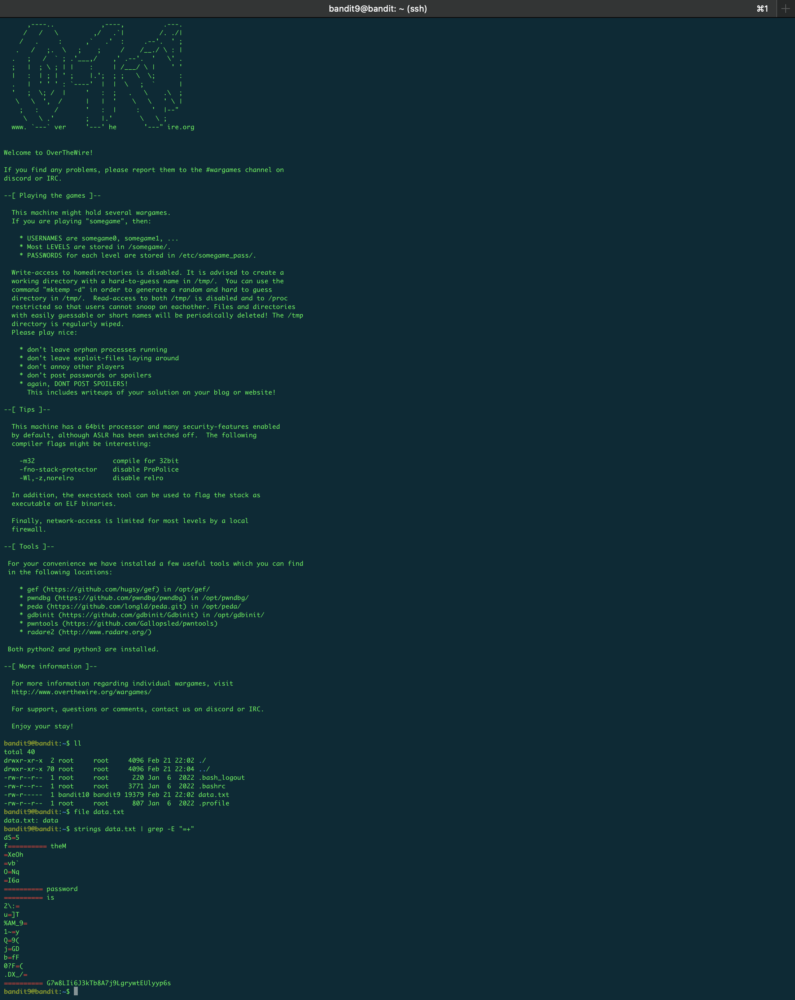

Commands that are used for this level 

`$ ssh bandit9@bandit.labs.overthewire.org -p 2220` - already used this command but with different username

`$ ll`  - already used this command

`$ file data.txt`  - checked which type file is

`$ strings data.txt | grep -E "=+"` 
- strings to convert data to strings 
- then grep output with regex 
- using `-E` for regex
- regex `"=+"` which means return all lines that contains 1 or more `=`
