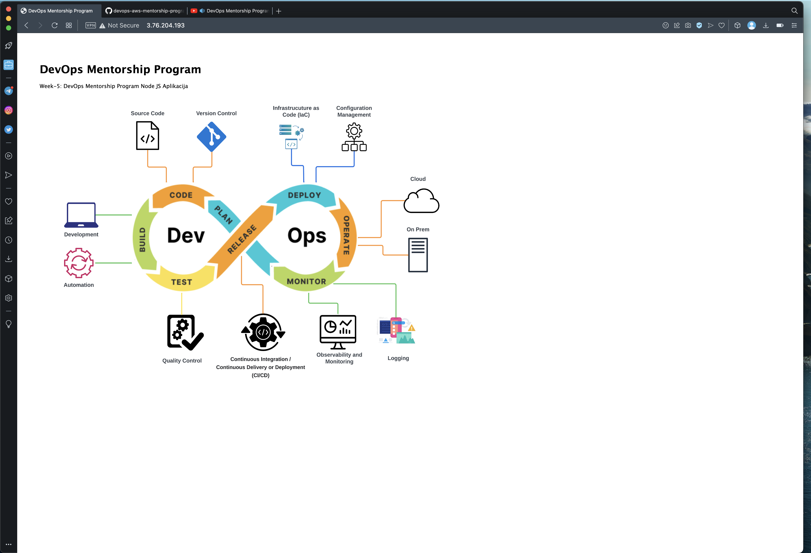
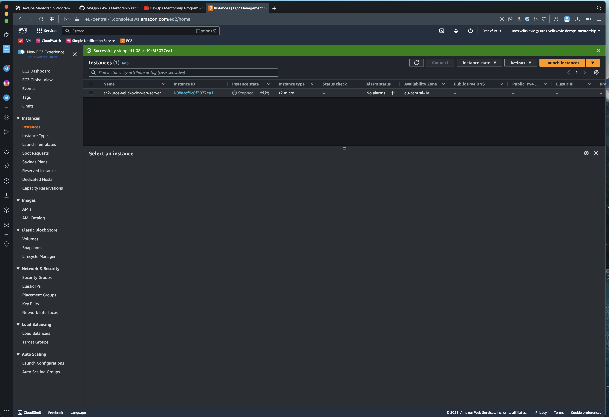
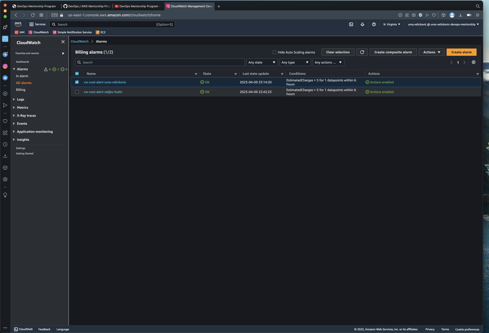

# Homework week 7 - Bandit tasks

## 1. Browser gdje se vidi da ste pristupili aplikaciji koja se nalazi na EC2 instanci
Screenshot of the browser

## 2. EC2 dashboard gdje se vidi EC2 instanca u statusu stopped

## 3. CloudWatch Alarm koji ste kreirali za troskove.

